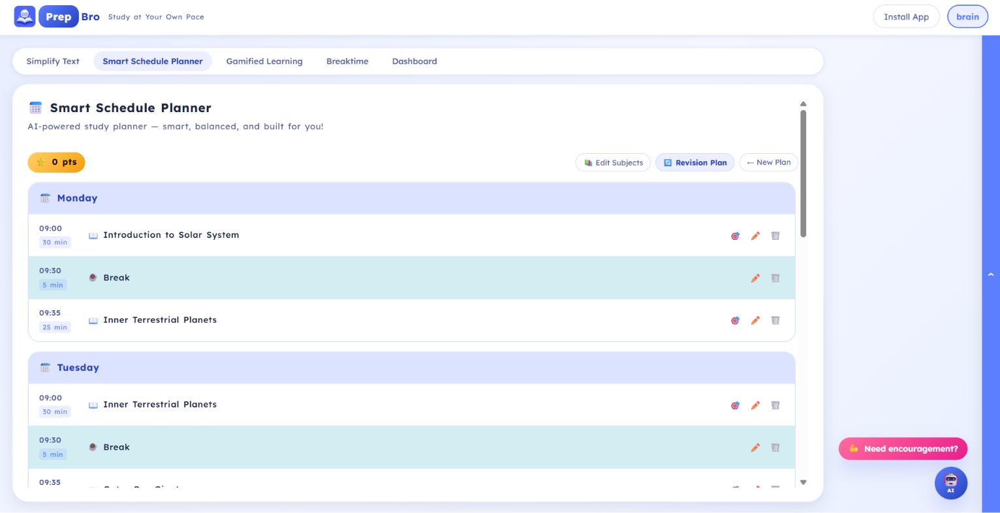
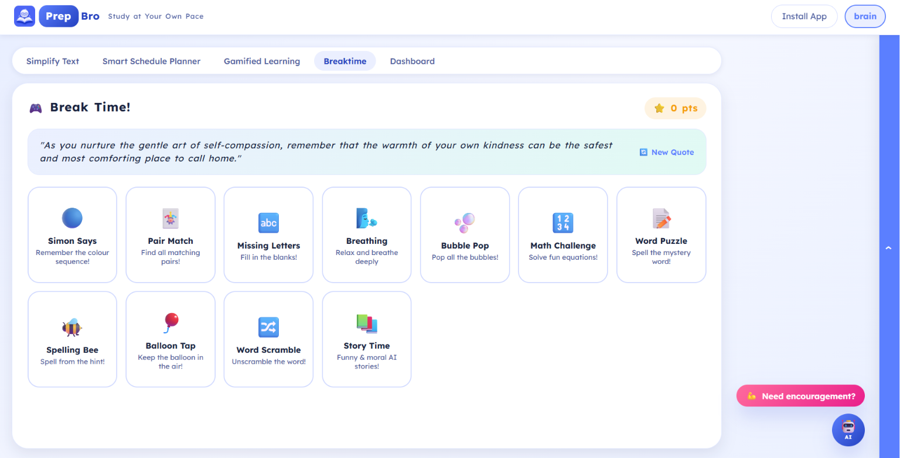
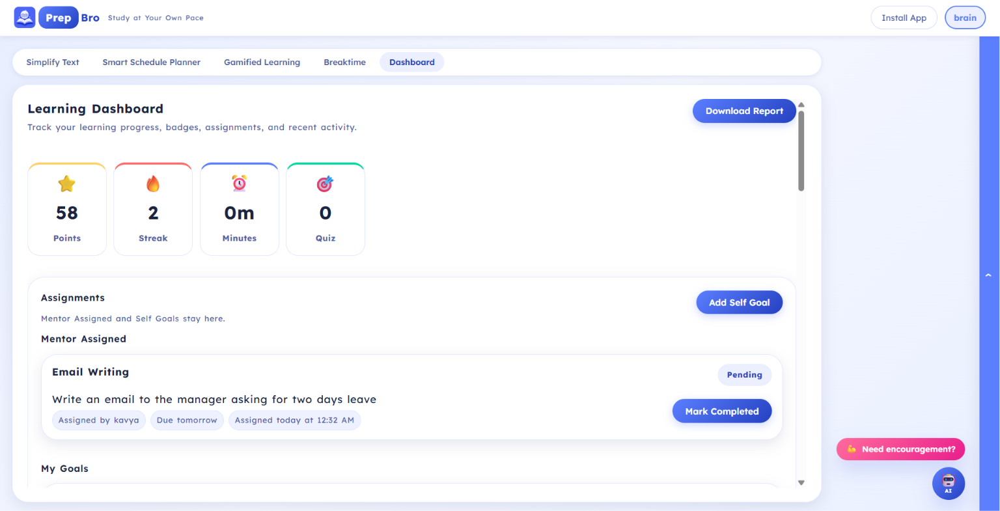
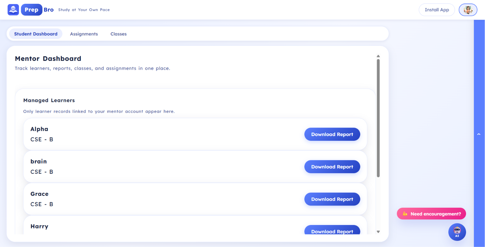

<p align="center">
  
</p>

<h1 align="center">PrepBro</h1>

<p align="center">
  <b>AI-Powered Accessibility-First Learning Platform</b>
</p>

<p align="center">
  Study at your own pace — simplify content, plan better, practice with quizzes, take healthy breaks, and track progress with mentor support.
</p>

<p align="center">
  
  
  
  
  
</p>

---


# PrepBro

## Study at Your Own Pace

**An AI-powered, accessibility-first learning platform that helps students simplify content, plan study time, learn through quizzes, take healthy breaks, track progress, and stay connected with mentors.**

---

## What Is PrepBro?

**PrepBro** is a smart learning platform designed to make studying easier, calmer, and more personalized.

It helps students understand difficult content, organize their study routine, practice through quizzes, take meaningful breaks, and track learning progress in one place.

PrepBro is especially helpful for students who need a more supportive and accessible learning experience, including learners with reading difficulties, attention challenges, or dyslexia-friendly study needs. At the same time, it is useful for any student who wants a simpler and more structured way to study.

---

## Why PrepBro Matters

Many students struggle with:

| Challenge                | How PrepBro Helps                                    |
| ------------------------ | ---------------------------------------------------- |
| Difficult study material | Simplifies text into easier language                 |
| Lack of study planning   | Creates structured study schedules                   |
| Low motivation           | Uses badges, points, goals, and progress tracking    |
| Stress during learning   | Provides break-time activities and encouragement     |
| No proper guidance       | Allows mentors to track and support learners         |
| Reading difficulty       | Offers accessibility settings and read-aloud support |

PrepBro brings learning, planning, practice, motivation, and mentoring together in one platform.

---

## Key Features

| Feature              | Purpose                                                 |
| -------------------- | ------------------------------------------------------- |
| ✏️ Simplify Text     | Makes complex content easier to understand              |
| 📅 Smart Scheduler   | Helps students plan study time                          |
| 🎮 Gamified Learning | Converts notes into quizzes                             |
| 🧘 Break Time        | Gives relaxing and fun activities                       |
| 📊 Dashboard         | Tracks progress, streaks, badges, and assignments       |
| 🎓 Mentor Support    | Helps mentors manage learners, classes, and assignments |

---

# Core Modules

---

## ✏️ Simplify Text

The **Simplify Text** feature helps students convert difficult content into clear and simple explanations.

Students can:

* Paste text directly
* Upload documents such as `.txt`, `.pdf`, or `.docx`
* Use voice input where supported
* Convert complex paragraphs into easier language
* Read simplified output comfortably
* Use read-aloud support for better understanding

### What It Generates

PrepBro can simplify learning material into:

| Output Type        | Description                                       |
| ------------------ | ------------------------------------------------- |
| Simple Explanation | Converts complex content into easy wording        |
| Key Points         | Highlights important ideas                        |
| Summary            | Gives a short version of the content              |
| Examples           | Helps students understand with relatable examples |
| Read Aloud         | Supports audio-based learning                     |

This is one of the most important parts of PrepBro because it directly reduces reading difficulty and cognitive overload.


### Simplify Text


---

## 📅 Smart Schedule Planner

The **Smart Schedule Planner** helps students study with structure instead of confusion.

Students can plan:

* Subjects to study
* Daily study target minutes
* Break time
* Study sessions
* Personal goals

### Why It Helps

A schedule gives students a clear direction. Instead of wondering what to study next, PrepBro helps them follow a simple and balanced plan.

### Main Benefits

| Benefit            | Explanation                             |
| ------------------ | --------------------------------------- |
| Better consistency | Helps students study regularly          |
| Less stress        | Breaks study time into manageable parts |
| Goal tracking      | Connects study time with progress       |
| Balanced learning  | Prevents overloading one subject        |


### Smart Schedule Planner




---

## 🎮 Gamified Learning

The **Gamified Learning** feature turns study material into interactive quizzes.

Students can:

* Paste notes
* Upload study documents
* Choose the number of questions
* Generate quizzes
* Answer questions
* Earn points
* Track quiz progress

### Why Gamified Learning Works

Instead of only reading notes, students actively recall what they learned. This improves memory and understanding.

### Gamified Elements

| Element             | Purpose                                  |
| ------------------- | ---------------------------------------- |
| Quizzes             | Practice from uploaded or pasted content |
| Points              | Reward learning progress                 |
| Badges              | Celebrate milestones                     |
| Streaks             | Encourage daily consistency              |
| Completion tracking | Shows how much the learner has practiced |

PrepBro also asks before loading the next set of questions so the student stays in control.

### Gamified Learning


---

## 🧘 Break Time

Learning should not feel exhausting. The **Break Time** section gives students short activities to relax, refresh, and return to learning with better focus.

### Break-Time Activities

| Activity            | Purpose                          |
| ------------------- | -------------------------------- |
| Breathing           | Helps the learner calm down      |
| Memory Games        | Builds focus and recall          |
| Word Puzzles        | Improves language skills         |
| Balloon Tap         | Light fun activity               |
| Bubble Pop          | Relaxing interaction             |
| Story Time          | Gives short fun or moral stories |
| Motivational Quotes | Encourages the learner           |

Break Time is designed to make studying feel lighter and healthier.

### Break Time




---

## 📊 Student Dashboard

The **Dashboard** shows the learner’s progress in a clear and motivating way.

Students can view:

* Total points
* Current streak
* Study minutes
* Quiz count
* Assignments from mentors
* Self goals
* Progress summary
* Points earned
* Study time
* Subject breakdown
* Achieved badges
* Locked badges
* Downloadable report

### Dashboard Highlights

| Section          | What It Shows                    |
| ---------------- | -------------------------------- |
| Stats            | Points, streak, minutes, quizzes |
| Mentor Assigned  | Assignments given by mentors     |
| My Goals         | Self-created learning goals      |
| Progress Summary | Useful learning insights         |
| Badges           | Achieved and locked milestones   |
| Reports          | Downloadable progress report     |

The dashboard helps students understand how they are improving over tim

PrepBro includes attractive achievement badges to motivate learners.

### Student Dashboard




---

## 🎓 Mentor Support

PrepBro includes a **Mentor Dashboard** for mentors who guide learners.

Mentors can:

* View linked learners
* Track learner progress
* Create and manage classes
* Assign learners to classes securely
* Create assignments
* Assign tasks to one learner, all learners, or a class
* View assignment completion status
* Give marks and feedback
* Download learner reports

### Mentor Dashboard Sections

| Section           | Purpose                                      |
| ----------------- | -------------------------------------------- |
| Student Dashboard | View learner progress                        |
| Assignments       | Create, edit, delete, and review assignments |
| Classes           | Create and manage learner groups             |
| Reports           | Download learner progress summaries          |

Mentors do not see student self-goals. They only see mentor-assigned work, learner progress, badges achieved, and report details.

### Mentor Dashboard




---

## 🔐 Authentication and Email Verification

PrepBro includes secure account handling.

### Account Features

* Signup and login
* Password validation
* Password hashing
* JWT-based authentication
* Protected user data
* Email verification
* Logout data clearing
* Profile photo support

### Email Verification

PrepBro sends a verification link to the user’s email. When the user clicks the link, the account becomes verified.

---

## 🏅 Badges and Rewards

PrepBro motivates learners with achievement badges for study time, quiz completion, daily goals, streaks, focus, subject practice, and mentor connection.

Achieved badges show completed milestones, while locked badges guide learners on what to do next.

---

## 📝 Assignments and Self Goals

PrepBro supports both mentor-assigned tasks and personal study goals.

Mentors can assign work to one learner, all learners, or a class. Students can view assigned work in their Dashboard, while students and guests can also create their own self goals to stay consistent.

---

## 👤 Account and Guest Mode

PrepBro can be used with or without an account.

Guests can study and track local progress on the same device. Student accounts save progress, assignments, badges, and reports. Mentor accounts help manage learners, classes, assignments, marks, and progress reports.

---

## 📱 Install App Support

PrepBro is prepared for installable app usage.

Supported install modes:

| Platform   | Support                            |
| ---------- | ---------------------------------- |
| Web App    | Browser-based usage                |
| PWA        | Install from supported browsers    |
| Mobile     | Prepared for mobile app deployment |
| PC/Desktop | Prepared for desktop app packaging |

The Install App page guides users through browser, mobile, and desktop installation options.

---

## Accessibility Features

PrepBro is designed with accessibility in mind.

### Accessibility Support

* Dyslexia-friendly learning experience
* Simplified text output
* Read-aloud support
* Clear spacing and readable layout
* Friendly visual design
* Reduced cognitive overload
* Break-time support
* Progress motivation through badges

---

### Demo
[▶️ Watch Demo Video](assets/Demo-PrepBro.mp4)

---

## Tech Stack

| Layer              | Technology                                      |
| ------------------ | ----------------------------------------------- |
| Frontend           | React, Vite, JavaScript                         |
| Styling            | CSS                                             |
| Backend            | FastAPI, Python                                 |
| Database           | SQLite                                          |
| Authentication     | JWT, bcrypt/passlib                             |
| Email Verification | SMTP                                            |
| AI Support         | Groq API / LLaMA models                         |
| Voice              | Web Speech API / SpeechSynthesis                |
| App Install        | PWA support                                     |
| Deployment Ready   | Vercel/Netlify frontend, Render/Railway backend |

---

## Project Structure

```text
PrepBro/
│
├── frontend/
│   ├── public/
│   │   ├── icons/
│   │   ├── manifest.json
│   │   └── favicon files
│   ├── src/
│   │   ├── components/
│   │   ├── pages/
│   │   ├── lib/
│   │   ├── App.jsx
│   │   ├── main.jsx
│   │   └── styles.css
│   ├── package.json
│   └── .env.example
│
├── backend/
│   ├── app/
│   │   ├── main.py
│   │   ├── auth.py
│   │   └── services/
│   ├── requirements.txt
│   └── .env.example
│
├── .gitignore
└── README.md
```

---

## Getting Started

### Prerequisites

Make sure these are installed:

* Node.js
* Python 3.10+
* pip
* Git

---

## Backend Setup

```bash
cd backend
pip install -r requirements.txt
```

Create a `.env` file inside the backend folder.

```env
DATABASE_URL=sqlite:///./prepbro.db
JWT_SECRET=your_secret_key
JWT_EXPIRE_MINUTES=1440
FRONTEND_URL=http://localhost:5173

SMTP_HOST=smtp.gmail.com
SMTP_PORT=587
SMTP_USER=your_sender_email@gmail.com
SMTP_PASSWORD=your_app_password
SMTP_FROM=PrepBro <your_sender_email@gmail.com>
SMTP_TLS=true
```

Run backend:

```bash
py -m uvicorn app.main:app --reload
```

Backend runs at:

```text
http://localhost:8000
```

---

## Frontend Setup

```bash
cd frontend
npm install
```

Create a `.env` file inside the frontend folder.

```env
VITE_API_BASE_URL=http://localhost:8000
VITE_APP_NAME=PrepBro
```

Run frontend:

```bash
npm run dev
```

Frontend runs at:

```text
http://localhost:5173
```

---

## Environment Variables

### Backend

| Variable           | Purpose                             |
| ------------------ | ----------------------------------- |
| DATABASE_URL       | Database connection path            |
| JWT_SECRET         | Secret key for login tokens         |
| JWT_EXPIRE_MINUTES | Token expiry time                   |
| FRONTEND_URL       | Frontend URL for verification links |
| SMTP_HOST          | Email server host                   |
| SMTP_PORT          | Email server port                   |
| SMTP_USER          | Sender email                        |
| SMTP_PASSWORD      | Sender app password                 |
| SMTP_FROM          | Sender display name                 |
| SMTP_TLS           | Enables secure email sending        |

### Frontend

| Variable          | Purpose         |
| ----------------- | --------------- |
| VITE_API_BASE_URL | Backend API URL |
| VITE_APP_NAME     | App name        |

---

## Deployment Ready

PrepBro is prepared for deployment using:

| Part     | Suggested Platform                                         |
| -------- | ---------------------------------------------------------- |
| Frontend | Vercel / Netlify                                           |
| Backend  | Render / Railway                                           |
| Database | SQLite for simple deployment, PostgreSQL recommended later |
| Email    | Gmail SMTP / production email service                      |

Before deployment:

* Do not commit `.env`
* Do not commit local database files
* Set production environment variables
* Update `FRONTEND_URL`
* Update `VITE_API_BASE_URL`
* Test signup, login, email verification, assignments, and dashboard

---

## Main User Flows

### Student Flow

```text
Create Account → Verify Email → Study → Complete Quizzes → Track Dashboard → Earn Badges
```

### Mentor Flow

```text
Create Mentor Account → Add Learners → Create Classes → Assign Work → Track Progress → Give Marks
```

### Guest Flow

```text
Use Tools → Create Self Goals → Track Local Progress → Continue Without Account
```

---

## Future Improvements

* Mobile application
* Desktop application
* Advanced mentor analytics
* Parent access mode
* More AI study tools
* Offline mode
* Push notifications
* PDF report export
* Adaptive difficulty quizzes
* Personalized AI tutor

---

## Why PrepBro Is Useful

PrepBro is not just a study app. It is designed to make learning:

* simpler
* calmer
* more accessible
* more structured
* more motivating
* more supportive

It helps learners study at their own pace while giving mentors the tools to guide them better.

---

## 📄 License

This project is open for learning, improvement, and responsible use.

---

## 👩‍💻 Developer

**Built by Kavya S**

Created with the goal of making learning simpler, more accessible, and more supportive for every student.

PrepBro is built to help learners study at their own pace, understand concepts better, stay consistent, and receive guidance through technology designed with care.

